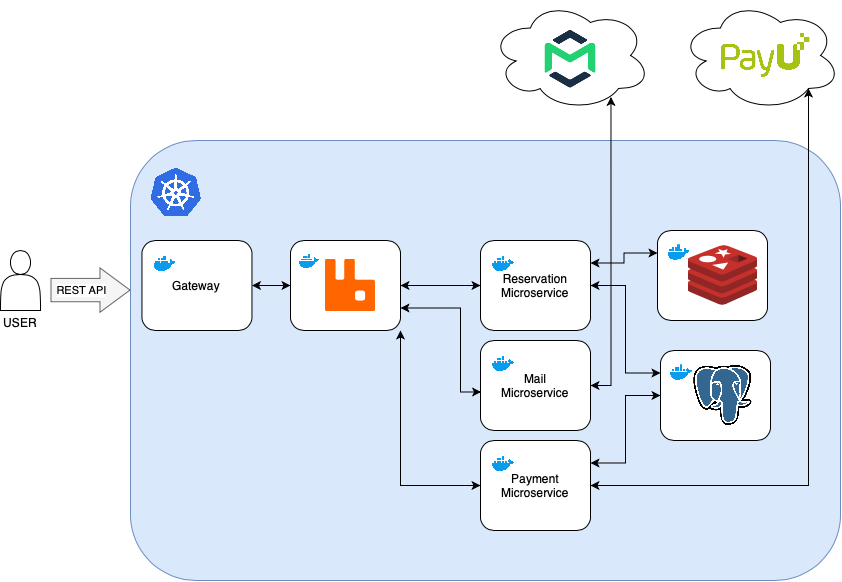

<h1 align="center"> Distributed Reservation System </h1>

## Architecture


## How to run
Prerequisites: installed: Java 21, Maven and Docker with configured Kubernetes
```
   ./k8s/deploy.sh
```

## Key features
### Microservices architecture:
- Containerization with **Docker** and running microservices on a local **Kubernetes** Cluster
- Implemented communication between microservices with **RabbitMQ**

### Distributed Locks
- Utilizing Redis as a locker for resources in distributed reservation transactions

### External APIs integration
- Integrated the app with **PayU payment gateway** and **MailTrap SMTP server** 

### Integration Testing
- The app's reliability is ensured with integration tests, using **TestContainers** to mock microservices 

## Technologies
- Java 21
- Maven
- Spring (Cloud, Boot, Data, AMQP, Validation, Email, Web)
- Hibernate, Postgres
- Redis
- RabbitMQ
- Docker, Kubernetes
